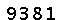

# Sipo

 采用k近邻算法进行分类识别。

## 只有数字的简单验证码

这种验证码的识别是最为简单的，规规矩矩。接下来我们就阐述一下识别方法。

使用模块:
```
pillow, numpy, sklearn
```

### 1.转为灰度图

首先，我们利用pillow打开图片。
```python
from PIL import Image

image = Image.open('doc/9381.png')
```


转为灰度图
```python
image = image.convert('L')
```

### 2. 增强色差

将图片转换为numpy数组
```python
import numpy as np

image = np.asarray(image)
print(image.shape)
```
打印一下图片的长宽
```python
(20, 60)
```
可见图片长60像素，高20像素。

我们需要将灰度图中大于135左右的像素转换为255，也就是把肉眼看上去比较黑的像素转为完全黑。



### 3. 切割数字

```python
split_parts = [
    [7, 16],
    [20, 29],
    [33, 42],
    [46, 55]
]
letters = []
for part in split_parts:
    letter = image[7:, part[0]: part[1]]
    letters.append(letter.reshape(9*13))
```

我们将切割后的数字保存下来。每个数字对应6份左右。

### 4. 构建knn分类器

装载数据
```python
def load_dataset():
    X = []
    y = []

    for i in range(70):
        path = "./train/%d%d.png" % (i / 7, i % 7)
        pix = np.asarray(Image.open(path).convert("L"))
        X.append(pix.reshape(9*13))
        y.append(int(i / 7))
    return np.asarray(X), np.asarray(y)
```

构建分类器并训练
```python
from sklearn.neighbors import KNeighborsClassifier

knn = KNeighborsClassifier()
knn.fit(X, y)
```

预测数据
```python
knn.predict(letters)
```

## 总结

总的来说，对于这种简单的验证码识别的准确率是蛮高的接近百分之百。另外我们可以使用sklean的joblib储存模块将训练的模型存放起来以后使用。