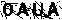
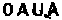

# Sipo2

## 带明显干扰的较为复杂的验证码

采用k近邻算法进行分类识别。

```python
pillow, numpy, sklearn
```
### 1. 转为灰度图

首先，我们利用pillow打开图片。

```python
from PIL import Image

image = Image.open('doc/0AUA.png')
```


转为灰度图

```python
image = image.convert('L')
```

### 2. 增强色差

将图片转换为numpy数组

```python
import numpy as np

image = np.asarray(image)
print(image.shape)
```
打印一下图片的长宽
```python
(20, 90)
```
我们需要将灰度图中大于237左右的像素转换为255，也就是把肉眼看上去比较黑的像素转为完全黑。

```python
def convert_to_pure_black_white(image):
    width = image.shape[1]
    height = image.shape[0]
    image[0] = 255
    for line in image:
        line[0] = 255
        line[-1] = 255
    image[-1] = 255
    for w in range(width):
        for h in range(height):
            if image[h][w] < 237:
                image[h][w] = 0
            else:
                image[h][w] = 255
    image2 = image[:, 13:73]
    return image2
```
一种比较复杂的写法，简洁写法参考sipo的readme



### 3. 清理干扰线

由上图可以看出，图片中的杂音还是很多的，我们可以通过线条粗细来进行噪音清理。

```python
def remove_noise_line(image):
    width = image.shape[1]
    height = image.shape[0]
    for w in range(width):
        count = 0
        for h in range(height):
            if image[h][w] < 100:
                count += 1
            else:
                if 2 > count > 0:
                    for c in range(count):
                        image[h - c - 1][w] = 255
                count = 0

    for h in range(height):
        count = 0
        for w in range(width):
            if image[h][w] < 100:
                count += 1
            else:
                if 2 > count > 0:
                    for c in range(count):
                        image[h][w - c - 1] = 255
                count = 0
    return image
```



### 4. 切割字符

由上图可以看出，此时的干扰已经不是很多了，剩下的部分也不影响我们的识别工作。

```python
def split_letters(image):
    letters = [image[:, : 15], image[:, 15: 30], image[:, 30: 45], image[:, 45: 60]]
    return letters
```

### 5.构建knn分类器并训练识别

```python
from sklearn.neighbors import KNeighborsClassifier
X, y = load_dataset()
knn = KNeighborsClassifier()
knn.fit(X, y)
```

主要步骤和sipo是差不多的，这里不再赘述。在不区分0和O的情况下准确率能达99%以上。